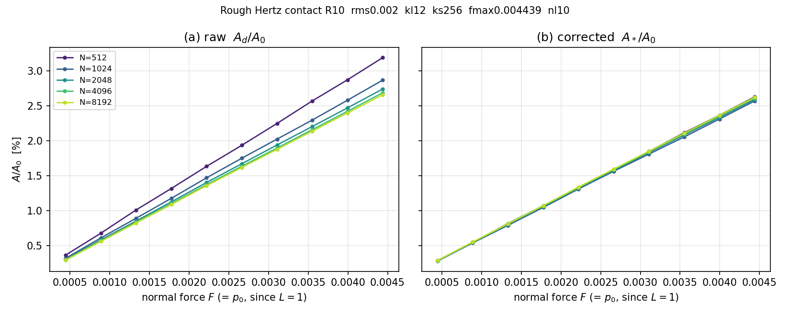

# Mesh-convergence of the true contact area — curved (rough-Hertz) case

Companion to the flat-surface study [`../repro/REPORT.md`](../repro/REPORT.md).
It applies the same area correction of

> V.A. Yastrebov, G. Anciaux, J.-F. Molinari,
> *On the accurate computation of the true contact-area in mechanical contact
> of random rough surfaces*, **Tribology International 114 (2017) 161–171**
> (`../2017_TI.pdf`, draft `../Yastrebov_et_al_Area_correction.tex`),

but to a **curved** geometry: a paraboloid indenter of radius $R = 10$ pressed
onto a rough half-space, giving a *localized* Hertzian contact patch rather than
a periodic bearing area. Everything here is produced by
[`curved_convergence_study.py`](../../../curved_convergence_study.py) with
`--mode converge`.

---

## 1. The area correction

The discrete area obtained by counting contacting nodes,
$A_d/A_0 = N_a/N^2$, **overestimates** the true area, with an error proportional
to the grid spacing $\Delta x = L/N$. The paper removes this leading term with a
purely geometric correction based on the length of the contact/non-contact
boundary:

$$\frac{A_*}{A_0} = \frac{N_a}{N^2} - c\,\frac{M}{N^2},
\qquad c = \frac{\pi - 1 + \ln 2}{24} = 0.11811416\ldots$$

Here $M$ is the number of contact/non-contact switches counted along every
horizontal and vertical grid line (the discrete perimeter is $S_d = M\,\Delta x$).
The coefficient $c = \beta\,\pi/4$ combines the mean over-counted sliver at a
boundary node, $\beta = (\pi-1+\ln 2)/(6\pi) \approx 0.15039$, with the factor
$\pi/4$ that converts the Manhattan (grid) perimeter to the Euclidean one.
Because $M/N^2 \propto \Delta x \to 0$, the correction vanishes on fine grids;
its purpose is to make a **coarse** grid as accurate as a fine one. The formula
is a geometric post-processing of the binary contact mask and is **identical**
to the flat case — nothing in it knows about the indenter shape or the elastic
kernel.

## 2. Method

* **Curved geometry, single window.** The initial gap is a centred paraboloid
  $z(x,y) = (x^2+y^2)/(2R)$ with $R=10$, evaluated analytically (hence exact on
  every grid), minus roughness. With $L=1$ and $E^*=1$ the solver's
  mean-pressure constraint makes $\bar p = F$, so the load axis is simply the
  applied force $F$.
* **One master surface, subsampled.** A self-affine roughness ($H=0.8$, band
  $\tilde k_l = 12$, $\tilde k_s = 256$ waves/box, **rms height $2\times10^{-3}$**)
  is generated once at a master grid $N = 8192$ and **subsampled** (`z[::s,::s]`)
  to each coarser grid. Because the band is fixed in physical waves/box, every
  grid sees the *same* surface. At $N = 512$ the shortest wavelength
  $\tilde k_s = 256$ sits exactly at Nyquist — two cells per shortest wavelength,
  $\Delta x = \lambda_s/2$ — the deliberately *undersampled* coarse limit the
  correction is designed for.
* **Sparse, patchy contact.** The rms roughness is $\approx 0.22$ of the Hertz
  penetration $\delta = a^2/R = 9\times10^{-3}$ at footprint $a \approx 0.3$, so
  the real contact is a *cloud of asperity-cluster spots* covering a small
  fraction of the nominal Hertzian footprint. This maximises the perimeter $M$
  and is precisely the regime where the correction matters most.
* **Non-periodic and confined.** The H2/FMM Boussinesq operator is a
  **non-periodic** half-space kernel, so the contact patch **must not touch the
  domain edge**. The load is chosen so the footprint stays well inside the
  $1\times1$ window; `measure()` flags any contact within a 3-cell frame of the
  boundary.
* **Two size metrics.** $a_{\mathrm{eff}} = \sqrt{A/\pi}$ is the equivalent
  radius of the *real* (small) contact area; $a_{90}$ is the *footprint* radius
  containing 90 % of contacting nodes — the extent of the contact cloud. At the
  maximum load $a_{90} \approx 0.30$.
* **Load sweep.** 10 load steps with $F$ linearly spaced from
  $4.439\times10^{-4}$ to $4.439\times10^{-3}$ (the maximum chosen from an
  exploration sweep as the force giving $a_{90}\approx0.3$), warm-started across
  steps.
* **Solver.** Frictionless non-adhesive normal contact via the non-periodic
  H2/FMM Boussinesq operator + Polonsky–Keer projected CG with the $|q|$
  spectral (Fourier) preconditioner.
* **Measurement.** From each converged pressure field: $N_a = \#\{p>0\}$, the
  switch count $M$, then $A_d/A_0$ and $A_*/A_0$.

### Difference from the flat study
The flat case used a periodic mean plane with roughness spanning the whole
window; here a global curvature localises contact into one interior patch, which
*requires* the non-periodic kernel (a periodic solve would leak the patch across
the edge). Otherwise the area correction is applied unchanged — the point of
this study is that it transfers to the curved geometry with no modification.
Results below are a **single** surface realisation; the correction is purely
geometric and needs no statistical averaging.

## 3. Result — the collapse



**(a) raw** $A_d/A_0$: the curves fan out by grid — the coarsest ($N=512$) lies
highest and each refinement drops toward the true area. **(b) corrected**
$A_*/A_0$: the same runs **collapse onto a single grid-independent curve**. The
flat-case collapse (Fig. 5 of the paper) is reproduced here for a curved,
non-periodic Hertzian contact.

### Numbers

Contact area at the highest load $F = 4.439\times10^{-3}$
(footprint $a_{90}\approx0.30$, $A/A_0 \approx 2.6\,\%$), as the grid is refined
— raw drifts **down** toward the true value from above, the corrected value is
already there:

| $N$  | $\Delta x = L/N$ | raw $A_d/A_0$ [%] | corrected $A_*/A_0$ [%] |
|------|------------------|-------------------|-------------------------|
| 512  | $1/512$          | 3.192             | 2.630                   |
| 1024 | $1/1024$         | 2.870             | 2.571                   |
| 2048 | $1/2048$         | 2.744             | 2.593                   |
| 4096 | $1/4096$         | 2.688             | 2.613                   |
| 8192 | $1/8192$         | 2.660             | 2.623                   |

The raw area drops monotonically ($3.192 \to 2.660\,\%$) as the grid is refined,
while the corrected value stays tight and converges to $\approx 2.62\,\%$: the
five corrected values lie within $0.06\,\%$ of area (2.57–2.63 %), against a raw
span of 2.66–3.19 %. At the coarsest grid the raw error (vs the fully resolved
$N=8192$) is $\approx 0.53\,\%$ of area, but the corrected $N=512$ value differs
by under $0.02\,\%$ — roughly a $30\times$ improvement at the undersampled limit
($\Delta x = \lambda_s/2$).

Averaged over the whole 10-step load sweep, the grid-to-grid spread
(max$-$min over $N$ at fixed $F$) falls from $0.301\,\%$ (raw) to $0.035\,\%$
(corrected) — an **$8.7\times$** reduction across the five grids 512–8192.

*(Per-grid solve times, 10 warm-started load steps, 20 threads:
$512 \to 7$ s, $1024 \to 25$ s, $2048 \to 143$ s, $4096 \to 755$ s,
$8192 \to 3583$ s.)*

### Deliverables

* [`converge_area_R10_rms0.002_kl12_ks256_fmax0.004439_nl10.svg`](converge_area_R10_rms0.002_kl12_ks256_fmax0.004439_nl10.svg)
  — the two-panel raw-vs-corrected convergence figure above.
* [`svg/`](svg/)`contact_N{N}_step{j}_F*.svg` — per-(grid, load-step) contact-area
  maps, drawn at **native** pixel resolution (`interpolation='none'`, no
  reference circles) so individual contacting pixels are visible; 10 steps per
  grid.
* [`cache/`](cache/)`*.pkl` — per-grid result arrays (resumable; delete a `.pkl`
  to force a recompute).

## 4. Reproduce

```bash
conda activate fenicsx-env
# convergence run: grids subsampled from the N=8192 roughness master, results
# cached per grid (drop the last grid to skip the ~1 h 8192 solve). An
# exploration mode (--mode explore) sweeps loads first to pick F_max.
OMP_NUM_THREADS=20 python curved_convergence_study.py --mode converge \
    --grids 512 1024 2048 4096 8192 --master 8192 \
    --R 10 --rms-rough 2e-3 --H 0.8 --kl 12 --ks 256 \
    --fmax 4.439e-3 --nloads 10 \
    --outdir doc/convergence_study/curved_converge
```

---

*Render:* `pandoc REPORT.md -o REPORT.pdf` (pdflatex).
