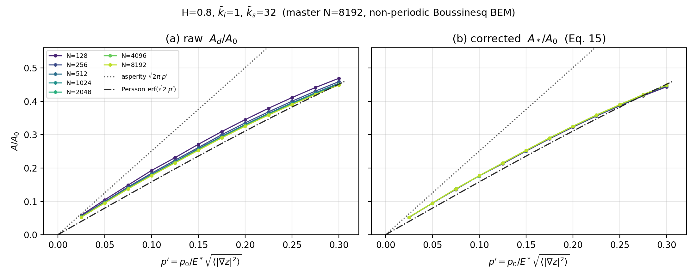
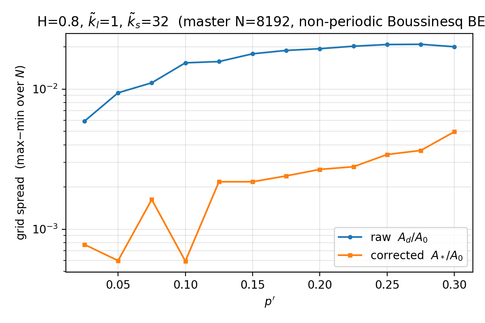

# Mesh-convergence of the true contact area — reproduction with the H2/FMM BEM

Reproduction of the central result of

> V.A. Yastrebov, G. Anciaux, J.-F. Molinari,
> *On the accurate computation of the true contact-area in mechanical contact
> of random rough surfaces*, **Tribology International 114 (2017) 161–171**
> (`../2017_TI.pdf`, draft `../Yastrebov_et_al_Area_correction.tex`).

using this repository's matrix-free **H2/FMM Boussinesq BEM** solver instead of
the periodic spectral (FFT) method of the paper.

Everything here is produced by [`convergence_study.py`](../../../convergence_study.py).

---

## 1. The area correction

The discrete contact area obtained by counting contacting nodes,
$A_d/A_0 = N_a/N^2$, **overestimates** the true area, and the error grows as the
mesh coarsens — it is proportional to the grid spacing $\Delta x = L/N$. The
paper removes this leading error with a purely geometric correction based on the
length of the contact/non-contact boundary:

$$A_* \approx A_d - \frac{\pi - 1 + \ln 2}{24}\, S_d\, \Delta x$$

with $S_d = M\,\Delta x$ the discrete perimeter, where $M$ is the number of
contact/non-contact switches counted along every horizontal and vertical grid
line. In area-fraction form this is completely discretisation-explicit:

$$\frac{A_*}{A_0} = \frac{N_a}{N^2} - c\,\frac{M}{N^2},
\qquad c = \frac{\pi - 1 + \ln 2}{24} = 0.11811416\ldots$$

The coefficient $c = \beta\,\pi/4$ combines two geometric facts:
$\beta = \dfrac{\pi - 1 + \ln 2}{6\pi} \approx 0.15039$ is the mean area of the
smaller part of a unit cell cut by a random line (the average over-counted
sliver at a boundary node), and $\pi/4$ converts the Manhattan (grid) perimeter
to the true Euclidean one.

Because $S_d\,\Delta x = M\,\Delta x^2 \to 0$ as $\Delta x \to 0$, the correction
vanishes on fine grids; its whole purpose is to make a **coarse** grid as
accurate as a fine one.

## 2. Method

* **One master surface.** A periodic self-affine surface (Hurst $H$, wavenumber
  band $[\tilde k_l, \tilde k_s]$ in waves-per-box) is generated once at
  $N = 8192$ with `rfgen.selfaffine_field`. Coarser grids are obtained by
  **subsampling** it (`z[::s, ::s]`), exactly as in the paper. Since the surface
  is band-limited to $\tilde k_s \ll N/2$ on every grid, subsampling introduces
  no aliasing — all grids see the *same* physical surface.
* **Discretisation-independent load axis.** Pressure is normalised by
  $E^* \sqrt{\langle |\nabla z|^2 \rangle}$ with the rms gradient measured
  **spectrally** ($\sqrt{\langle |\nabla z|^2 \rangle} = \sqrt{2 m_2}$ from the
  second spectral moment), so it does not depend on the grid. Without this, both
  the area and the abscissa would move with $N$ and the convergence test would be
  meaningless.
* **Contact solve.** Frictionless non-adhesive normal contact via the H2/FMM
  Boussinesq operator + Polonsky–Keer projected CG with the $|q|$ spectral
  preconditioner. Each grid is load-stepped over $p'$ with warm starts, and each
  finer grid's cold start is seeded from the coarser grid's solution (pixel
  prolongation) — so even $N = 8192$ starts cheaply.
* **Measurement.** From each converged pressure field: $N_a = \#\{p > 0\}$,
  $M$ = switch count, then $A_d/A_0$ and $A_*/A_0$.

### Difference from the 2017 paper
The paper used a **periodic** spectral/Westergaard kernel; here the elastic
kernel is the repository's **non-periodic** half-space Boussinesq (Love-cell)
operator. The area correction is a geometric post-processing **independent of
the elastic kernel**, so the collapse is reproduced regardless; only the
absolute level relative to the Persson/asperity reference curves carries a mild
free-edge effect. Results below are a single surface realisation (the paper
averages several for statistics).

## 3. Result — the collapse



**(a) raw** $A_d/A_0$: the curves fan out by grid — the coarsest ($N=128$) lies
highest and each refinement drops toward the true area, sitting well above
Persson's $\mathrm{erf}(\sqrt{2}\,p')$. **(b) corrected** $A_*/A_0$: the same runs
**collapse onto a single grid-independent master curve** that follows the
Persson reference. This is Fig. 5 of the paper, reproduced with a completely
different (non-periodic) solver.



The grid-to-grid spread (max$-$min over $N$ at fixed $p'$) drops by roughly an
order of magnitude after correction — a coarse $N = 2\tilde k_s$ grid becomes as
accurate as the finest one.

### Numbers

Contact area at the highest load $p' = 0.30$ ($H=0.8$, $\tilde k_l=1$,
$\tilde k_s=32$), as the grid is refined — raw drifts down toward the true value
from **above**, the corrected value is already there:

| $N$  | $\Delta x = L/N$ | raw $A_d/A_0$ | corrected $A_*/A_0$ | switches $M$ |
|------|------------------|---------------|---------------------|--------------|
| 128  | $1/128$          | 0.4692        | 0.4438              | 3 524        |
| 256  | $1/256$          | 0.4592        | 0.4463              | 7 129        |
| 512  | $1/512$          | 0.4544        | 0.4479              | 14 351       |
| 1024 | $1/1024$         | 0.4516        | 0.4483              | 28 748       |
| 2048 | $1/2048$         | 0.4503        | 0.4486              | 57 533       |
| 4096 | $1/4096$         | 0.4496        | 0.4487              | 115 140      |
| 8192 | $1/8192$         | 0.4492        | 0.4488              | 230 435      |

Refining the grid drives **raw** down toward the true area from *above*
($0.4692 \to 0.4492$) and **corrected** up from *below* ($0.4438 \to 0.4488$);
the two meet at $A/A_0 \approx 0.449$. The coarsest grid's raw error (vs
$N=8192$) is $0.020$ ($\approx 4.5\%$); the corrected $N=128$ value is already
within $0.005$ ($\approx 1.1\%$) — the correction buys about four grid
refinements ($N=128$ corrected $\approx N=512$ raw). $M \propto N$ confirms
$S_d = M\,\Delta x$ is grid-independent, so the correction
$\propto M/N^2 \propto \Delta x \to 0$.

Averaged over the whole $p'$ sweep, the grid-to-grid spread (max$-$min over $N$)
falls from $1.63\times 10^{-2}$ (raw) to $2.32\times 10^{-3}$ (corrected) — a
$7.0\times$ reduction across all seven grids (128–8192).

*(Solve times, 20 threads, warm-start seeded, full 12-step load sweep:
128 $\to$ 1.4 s, 256 $\to$ 4.5 s, 512 $\to$ 21 s, 1024 $\to$ 96 s,
2048 $\to$ 531 s, 4096 $\to$ 2 539 s, 8192 $\to$ 11 572 s.)*


## 4. Reproduce

```bash
conda activate fenicsx-env
# cheap grids (seconds–minutes):
OMP_NUM_THREADS=20 python convergence_study.py --grids 128 256 512 1024 2048
# add the expensive grids later — results are cached per grid and resumed:
OMP_NUM_THREADS=20 python convergence_study.py --grids 128 256 512 1024 2048 4096 8192
# second spectral case with a PSD plateau:
OMP_NUM_THREADS=20 python convergence_study.py --kl 4 --ks 128 --grids 256 512 1024 2048 4096
```

Figures land in `doc/convergence_study/repro/`, per-grid caches in
`.../repro/cache/` (delete a `.pkl` to force a recompute).

---

